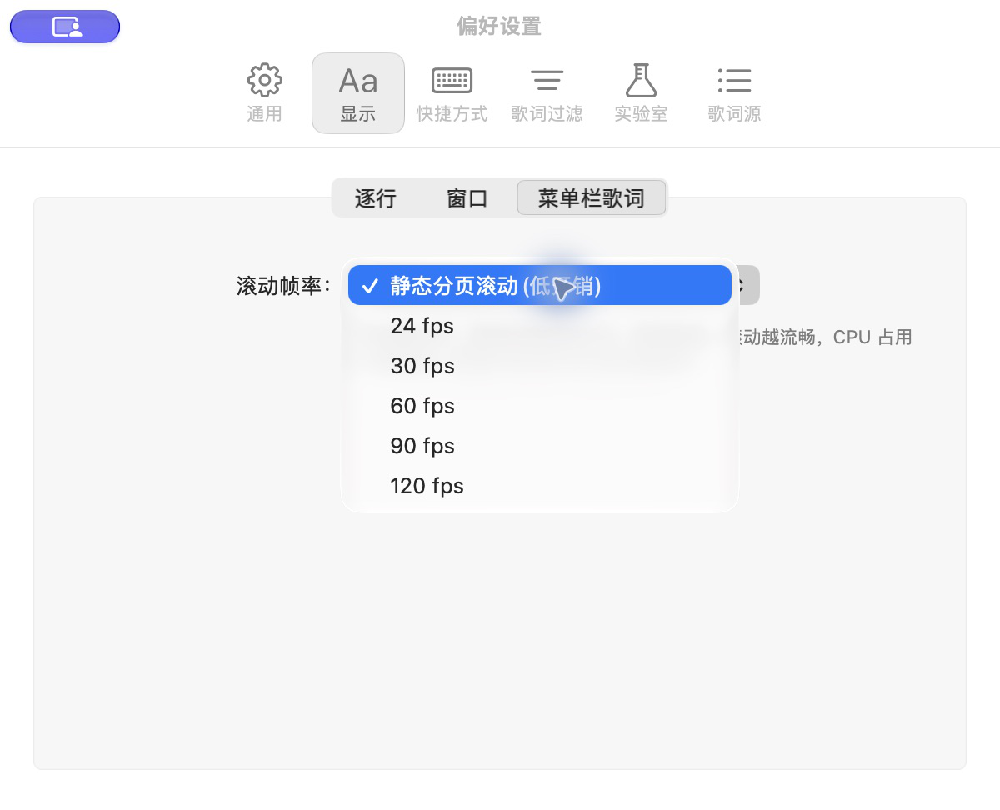
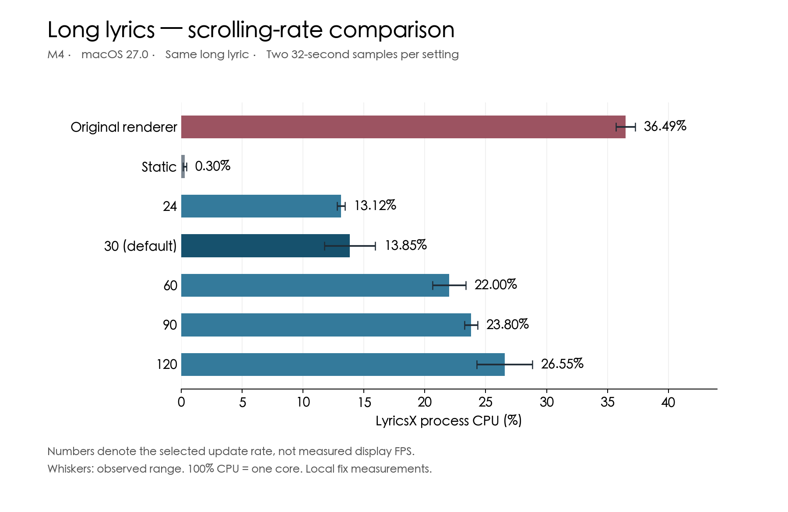
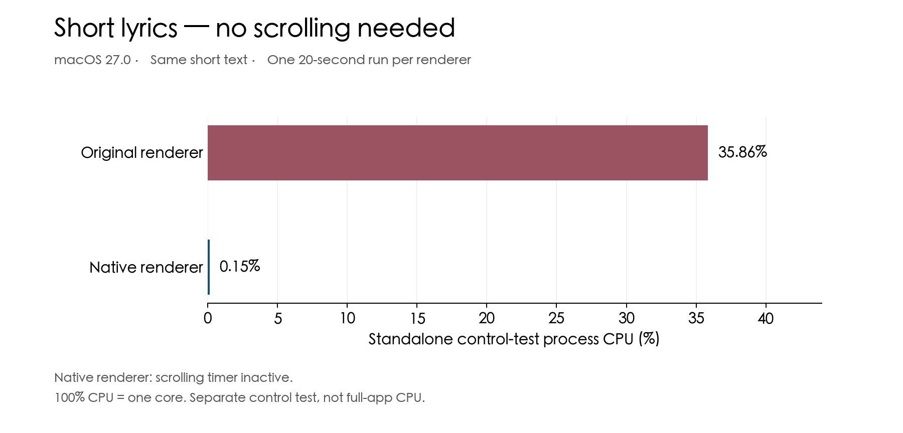

# Reduce menu bar lyric CPU usage on macOS 26+

On macOS 26/27, I found that enabling menu-bar lyrics caused high CPU usage both when long lines scrolled and when short lines did not need to scroll, alongside increased heat and faster battery drain.

Control comparisons pointed to the original `MarqueeLabel` rendering path, which uses `NSTextField` and frame animation, as the main source of CPU overhead. On macOS 26+, this change replaces that path with cached text drawing inside the existing `NSStatusItem`; earlier macOS versions retain the original behavior.

This approach was inspired by [ClashX.Meta #166](https://github.com/MetaCubeX/ClashX.Meta/issues/166), which reported similar menu-bar CPU usage on macOS 26.1. In [forget-pro’s fix](https://github.com/forget-pro/ClashX.Meta/commit/bb4ef4e7ca990dd26effff7c278499fed0bd1682), the upload/download speed labels were changed from `NSTextField` to a custom-drawn `NSView`. This PR adapts that approach for lyrics, adding cached text drawing, frame-rate limits and static paging.

An upstream `develop` build (`3407687`) showed **55.1% CPU** in Activity Monitor on this Mac. This snapshot documents the symptom; the controlled comparisons are below.

### Changes

The following changes reduce CPU usage across the available settings:

- Add static paging and 24 / 30 / 60 / 90 / 120 fps options, with 30 fps as the default.
- Show long lyrics in stationary pages in static mode, so the end of a line remains readable.
- Stop animation timers when scrolling is unnecessary, playback is paused, or the view is hidden.

The six choices in this PR build.

### Results and impact

#### Long lyrics

At the default 30 updates/s, measured average LyricsX CPU usage fell from **36.49% to 13.85%**. The chart includes static mode and all five scrolling rates; each result uses two 32-second samples on an M4 running macOS 27.0. Whiskers show the observed range.

#### Short lyrics — no scrolling needed

In a standalone control test, CPU usage for the same short text fell from **35.86% to 0.15%**, with one 20-second run per renderer. The native control's scrolling timer stayed off, showing that the optimization also benefits short lyrics that fit without scrolling.

### Compatibility

The change builds successfully against your `develop` branch; the six-choice UI and selection persistence after restarting have been verified. Manual playback checks passed for long and short lyrics, static paging, pause/resume and the playback controls. Earlier macOS versions retain the original behavior, though live testing on those versions has not been performed. The change is limited to menu-bar lyrics and their preferences.

---

在 macOS 26/27 上开启菜单栏歌词后，不仅长句滚动时 CPU 占用偏高，短句无需滚动时也存在明显开销，并伴随发热和耗电加快。

通过控件对照，主要 CPU 开销定位到原 `MarqueeLabel` 中基于 `NSTextField` 和位置动画的渲染路径。因此，将 macOS 26+ 的这条路径改为在现有 `NSStatusItem` 内绘制缓存文字；更早的 macOS 保留原行为。

这次修复参考了 [ClashX.Meta #166](https://github.com/MetaCubeX/ClashX.Meta/issues/166)：该项目在 macOS 26.1 上也报告了类似的菜单栏高 CPU 占用。[forget-pro 的修复](https://github.com/forget-pro/ClashX.Meta/commit/bb4ef4e7ca990dd26effff7c278499fed0bd1682)将菜单栏网速文字从 `NSTextField` 改为自绘 `NSView`。本次借鉴这一思路，并针对歌词加入文字缓存、帧率限制和静态分页。

上游 `develop` 构建（`3407687`）在本机活动监视器中显示 **55.1% CPU**。这张截图记录现场现象，下面另列受控对照结果。

### 改动

以下改动降低了各档位的 CPU 开销：

- 增加静态分页滚动和 24 / 30 / 60 / 90 / 120 fps 选项，默认 30 fps。
- 静态模式按页原地切换长歌词，让后半句也能完整显示。
- 无需滚动、暂停播放或视图隐藏时，停止动画计时器。

本次投稿构建中的六个选项。

### 结果与影响

#### 长句滚动

默认每秒更新 30 次时，测得 LyricsX 平均 CPU 占用从 **36.49% 降至 13.85%**。图中包含静态及全部五档滚动频率；测试使用 M4、macOS 27.0，每组两轮 32 秒，横线表示观测范围。

#### 短句：无需滚动

在独立控件测试中，同一短句的 CPU 占用从 **35.86% 降至 0.15%**，每种渲染器单轮 20 秒。原生控件的滚动计时器始终未运行，说明优化也覆盖能直接显示完整的短句。

### 兼容性

已基于你的 `develop` 分支成功构建，并验证了六档设置显示与重启后的选择持久化。长短句显示、静态分页、暂停／恢复及播放按钮已通过实际播放复核。旧 macOS 保留原行为，但尚未进行旧 macOS 实机测试。改动仅涉及菜单栏歌词及其设置。
