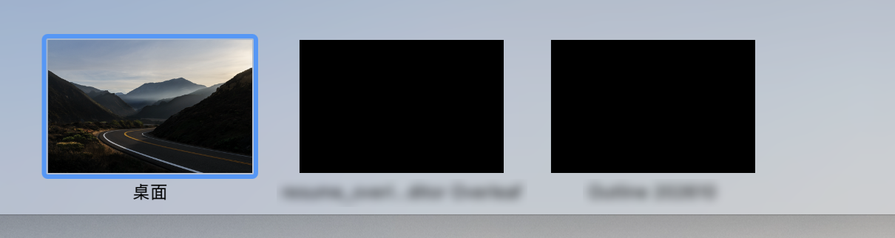
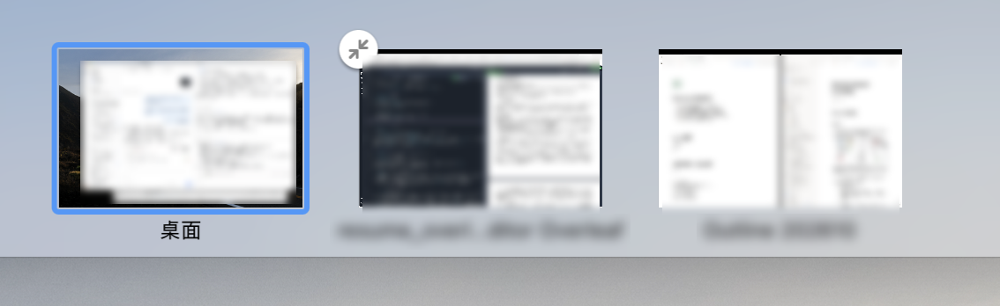

# Fix black full-screen previews in Mission Control

I found that full-screen app previews in Mission Control turned black while LyricsX was running. Quitting LyricsX restored them.

The issue was traced to the transparent desktop lyric window: it covered the entire display, although the text occupied only a small area. **The window was screen-sized even while lyrics were visible.** Hiding the content did not resize or remove the window, leaving an unnecessary screen-sized window in both states.

### Fix

The existing window now handles the following cases:

- **Mission Control:** replace [`stationary`](https://developer.apple.com/documentation/appkit/nswindow/collectionbehavior-swift.struct/stationary), which keeps the window visible there, with [`transient`](https://developer.apple.com/documentation/appkit/nswindow/collectionbehavior-swift.struct/transient), which hides it. Keep cross-Space visibility. Both behaviors are defined in Apple's documentation.
- **Lyrics visible:** size the window to the text and padding, updating it when the content or layout changes. In a two-line test, the window shrank from 1800 × 1130 to 456 × 92 points. Adjust dragging and screen bounds while preserving lyric placement.
- **Lyrics disabled or empty:** call [`orderOut`](https://developer.apple.com/documentation/appkit/nswindow/orderout%28_%3A%29), which Apple documents as removing the entire window from the screen list.

#### Before

#### After

### Validation

Changing only `transient` did not resolve the issue with desktop lyrics enabled. After sizing the window to its content, previews recovered **while lyrics remained visible**, with screenshot hiding both on and off. This verifies the enabled case as well as removing the window when lyrics are disabled.

The `develop` port builds successfully and passed the same manual checks: desktop lyrics enabled, screenshot hiding on and off, and desktop lyrics disabled.

### Compatibility

This changes desktop-window sizing and visibility on all supported macOS versions. Multi-display dragging, large fonts and vertical lyrics are the main regression areas; live testing of multi-display dragging and older macOS versions has not been performed. The change is independent of the menu-bar renderer.

---

运行 LyricsX 时，调度中心内全屏应用的预览会变黑，退出 LyricsX 后恢复正常。

排查定位到“桌面歌词”使用了覆盖整个显示器的透明窗口，实际文字却只占一小块区域。**歌词正常显示时，这个窗口也是整屏大小。** 隐藏内容既不会缩小窗口，也不会将它移出显示，因此两种状态下都存在不必要的整屏窗口。

### 修复

调整现有窗口，分别处理以下情况：

- **进入调度中心时：**将会保持窗口可见的 [`stationary`](https://developer.apple.com/documentation/appkit/nswindow/collectionbehavior-swift.struct/stationary) 改为会隐藏窗口的 [`transient`](https://developer.apple.com/documentation/appkit/nswindow/collectionbehavior-swift.struct/transient)，同时保留跨空间显示。这两种行为均由 Apple 官方文档定义。
- **歌词显示时：**将窗口缩至文字及留白大小，随内容或布局变化更新。一次双行歌词实测中，窗口从 1800 × 1130 点缩至 456 × 92 点。同时调整拖动和屏幕边界计算，保留歌词位置。
- **歌词关闭或为空时：**调用 [`orderOut`](https://developer.apple.com/documentation/appkit/nswindow/orderout%28_%3A%29)。Apple 文档明确说明，这会将整个窗口从屏幕窗口列表中移除。

#### 修复前

#### 修复后

### 验证

仅修改 `transient` 没有解决桌面歌词开启时的黑屏。采用内容尺寸窗口后，**保持歌词显示时预览也恢复了正常**，截图隐藏设置开启、关闭均通过。这验证了开启状态下的修复，也覆盖关闭时移除窗口的情况。

`develop` 移植版已成功构建，并通过相同的实机复核：桌面歌词显示、截图隐藏开启／关闭，以及关闭桌面歌词。

### 兼容性

这个改动会影响所有支持的 macOS 版本中的桌面窗口尺寸与可见性。多屏拖动、大字号和竖排歌词是主要回归关注点；尚未进行多屏拖动及旧 macOS 实机测试。此改动独立于菜单栏渲染器。
